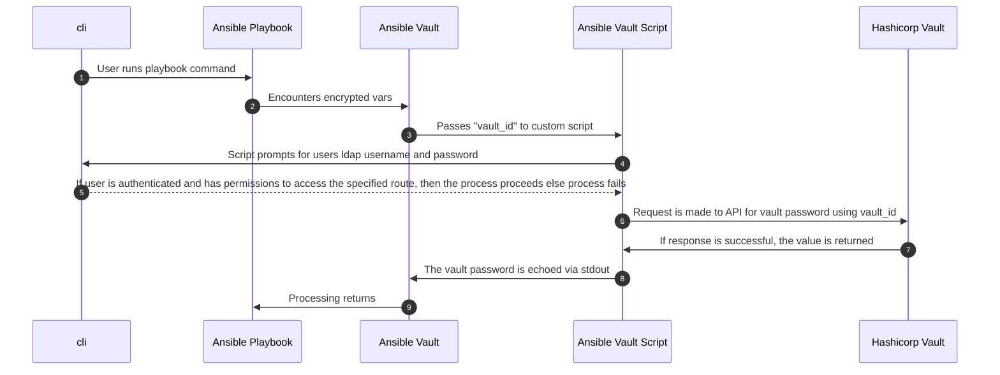

## Finding Aid Discovery - Ansible
---

- [Vault Files](#vault-files)

## Vault Files

The passwords for the vault files are stored in HashiCorp Vault and are made accessible by using the appropriate `vault-id` along with the convenience script: [vault_passwd-client.py](vault_passwd-client.py). See the [Ansible documentation](https://docs.ansible.com/ansible/latest/user_guide/vault.html#storing-passwords-in-third-party-tools-with-vault-password-client-scripts) for more information.

First, the client script must be executable (e.g. `chmod +x vault_passwd-client.py`) and the [hvac package](https://pypi.org/project/hvac/) must be installed (`pip install hvac`). The previous requirements have been addressed within the Vagrant development environment; you can skip those steps and freely interact with the vault files when working in the virtual machine.

Next, ensure you are a member of the group or have the appropriate permissions to access the HashiCorp Vault endpoint. Then, to edit the `finding_aid_discovery_vault.yml` file in the vagrant inventory with the `vagrant` vault-id for example, run the following command:

```
ansible-vault edit --vault-id vagrant@vault_passwd-client.py inventories/vagrant/group_vars/docker_swarm_manager/finding_aid_discovery_vault.yml
```

You will be prompted for your credentials. After you are authorized you will be able to modify the contents of the file. 


Below is a breakdown of the process when attempting to decrypt using the vault-id and script:


