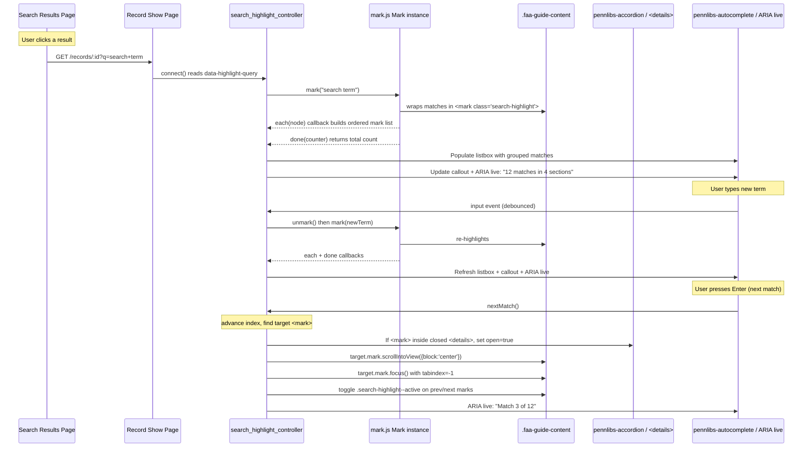

# feat: Add search highlighting and in-page search to record pages

## Summary

Adds client-side search term highlighting and a ctrl-f-style in-page search input to record pages using mark.js, realized through the Penn Libraries Design System (autocomplete/listbox for the match list, callout for status, focus-indicator + DS tokens for accessibility). Navigation opens collapsed `<details>` sections on demand. Scoped to rendered description content; inventory inherits coverage for free when inventory rendering ships.

---

## Problem Frame

Researchers arriving at a finding-aid record page from search results lose track of why they opened the page — there is no visual indication of where their query term appears. The page is large (description sections + eventual inventory tree), and the in-page search experience is currently the browser's native Ctrl+F, which provides no match overview or keyboard-accessible navigation between matches positioned in collapsed accordion sections. Issue 122 (GitLab) captures this gap; the brainstorm confirmed a combined scope: arrival highlighting, live in-page search input, and an accessible match-summary list keyed to the Penn Libraries Design System.

---

## Requirements

- **R1.** mark.js highlights the search term in the rendered guide content on record pages (`app/components/catalog/show_document_component.html.erb`).
- **R2.** Arrival highlighting — when a user clicks a search result, the record page auto-highlights the incoming query term (plumbed via a URL query parameter).
- **R3.** In-page ctrl-f input — a user types a term into an in-page search input and matching text highlights live as they type.
- **R4.** Match-summary listbox — a keyboard-navigable list of matched sections (grouped by nearest section heading, with per-section match counts) via the Penn Libraries `pennlibs-autocomplete` / `role="listbox"` pattern.
- **R5.** Next/prev match navigation via keyboard (Enter / Shift+Enter), with on-demand expansion: if the target match lives inside a collapsed `<details>` / `pennlibs-accordion`, that container opens automatically before scrolling to the match.
- **R6.** Accessibility — WCAG 1.4.11 / 2.4.7 / 2.4.13 focus indicators on active `<mark>` elements, an ARIA live region announcing match count and current position, and Penn Libraries DS focus-indicator tokens (`--pl-focus-box-shadow`).
- **R7.** Penn Libraries Design System coherence — search input uses the autocomplete/listbox pattern, status/count uses the `pl-callout` pattern, and existing `mark.search-highlight` CSS classes are consumed as-is.

---

## Scope Boundaries

- **Excluded:** lunr.js-style tokenized/fuzzy/fielded search (noted as future enhancement).
- **Excluded:** Eager expand-all of the entire finding aid on search — on-demand expansion only.
- **Excluded:** Searching content not present in the rendered DOM (raw Solr-stored EAD XML fields not displayed).
- **Excluded:** Relevance ranking of matches beyond document order.
- **Excluded:** Shareable/permalinkable in-page search state — the search state is transient per page visit.
- **Excluded:** Full EAD inventory rendering — the inventory section is currently a stub (`<p> todo: render inventory ^_^ </p>`). This plan scopes highlighting to the description accordion sections (bioghist, scopecontent, arrangement, etc.) and any inventory content that has been rendered at the time the highlighting executes.

### Deferred to Follow-Up Work

- **Full inventory coverage:** When the EAD inventory/series/subseries tree is rendered, search highlighting inherits coverage for free because the Stimulus controller and on-demand expansion are scoped generically to the guide content container and all `<details>` descendants. No code changes needed to the highlighting feature at that point. The inventory rendering is tracked separately (not part of this plan).

---

## Context & Research

### Relevant Code and Patterns

- **Record page layout:** `rails_app/app/components/catalog/show_document_component.html.erb` — the `.faa-guide-content` container holds the description accordion (`pennlibs-accordion` wrapping `DetailsComponent`s with native `<details>` / `<summary>` elements) and the inventory stub.
- **EAD markup translation:** `rails_app/app/components/ead_markup_translation_component.rb` and `rails_app/services/ead/translation/service.rb` — render EAD XML to HTML on the fly. mark.js operates on the rendered DOM, so EAD translation internals do not need changes.
- **Description accordion:** `rails_app/app/components/description_accordion_component.html.erb` — each section is a `DetailsComponent` (native `<details>`) inside a `pennlibs-accordion`. An expand-all/collapse-all toggle uses `data-pl-accordion-toggle`.
- **Existing CSS:** `rails_app/app/assets/stylesheets/fa-record.css` lines 655-659 — `mark.search-highlight { background: var(--pl-color-bg-attention-emphasis); ... }` — ready to be consumed.
- **Stimulus wiring:** `rails_app/app/javascript/application.js` imports `controllers`, and `rails_app/app/javascript/controllers/index.js` eager-loads all controllers from `rails_app/app/javascript/controllers/`. The only existing controller is `map_controller.js` (Leaflet map for regional repositories).
- **Penn Libraries web components:** Loaded from CDN (`@penn-libraries/web@1.4.0-dev.4` per `rails_app/config/settings.yml`) via `javascript_import_module_tag` in `rails_app/app/views/layouts/blacklight/base.html.erb`. `pennlibs-autocomplete`, `pennlibs-accordion`, `pennlibs-header`, `pennlibs-hero`, `pennlibs-footer`, `pennlibs-feedback` are all available.
- **JS bundling:** Importmap-rails (`rails_app/config/importmap.rb`) — no node/npm. mark.js can be pinned via `./bin/importmap pin mark.js` or from CDN.
- **Search session disabled:** `rails_app/app/controllers/catalog_controller.rb` line 51 sets `config.track_search_session.storage = false`. Blacklight's `session_tracking_params` in `url_helper_behavior.rb` returns early when `track_search_session.storage` is false. Arrival highlighting must use an explicit URL query parameter, not the search session.
- **System testing:** `rails_app/spec/system/` has `results_spec.rb`, `static_pages_spec.rb`, `status_spec.rb`, and `admin/` directory. No existing catalog show-page system specs. The project uses RSpec with system specs backed by a headless browser (likely Selenium/Capybara via Docker).

### Institutional Learnings

- No existing `docs/solutions/` entries found for search highlighting or mark.js.

### External References

- **mark.js:** `/websites/markjs_io` — `new Mark(contextElement)`, `.mark(term, options)`, `.unmark()` API. Callbacks: `each(node)` fires per marked `<mark>` element (used to build the match list and navigation index), `done(counter)` fires with total count (used for the callout and ARIA live region), `filter(textNode, foundTerm, total, counter)` filters nodes (exclude the search input itself, exclude nav elements), `noMatch(term)` handles zero-match state. Options: `separateWordSearch`, `accuracy`, `caseSensitive`, `diacritics`, `exclude` (CSS selectors to skip).
- **Penn Libraries Design System:** `https://designsystem.library.upenn.edu/` v1.4.0. `pennlibs-autocomplete` wraps an input + `role="listbox"` with arrow-key navigation. `pl-callout` for status/announcement surfaces. Focus indicator pattern with `--pl-focus-box-shadow` token.

---

## Key Technical Decisions

- **mark.js Mark instance scoped to `.faa-guide-content`:** Excludes the header, TOC nav, and the search input itself from the search scope without hard-coding selectors in mark.js `exclude`. The `.faa-guide-content` container (inside `show_document_component.html.erb`) is the natural boundary of the rendered guide text.
- **Query plumbing via explicit URL param (not search session):** Since `track_search_session.storage` is disabled, the incoming query must travel as a URL parameter on result→record links. The simplest approach is to append `?q=<encoded query>` to each record link on the results page. The show page reads `params[:q]` and passes it to the Stimulus controller.
- **Stimulus controller over inline JS:** All client-side behavior lives in a single Stimulus controller (`search_highlight_controller.js`) to stay consistent with the repo's conventions (importmap + Stimulus). No jQuery — mark.js has a native JS API.
- **`pennlibs-autocomplete` repurposed as match-summary listbox:** The autocomplete web component is designed for predictive suggestions, but its listbox pattern (input + `role="listbox"` + arrow-key nav) is the design-system-native home for the match-summary list. The controller dynamically populates the listbox content from mark.js `each` callbacks rather than fetching server suggestions.
- **On-demand expansion via `<details>` open property:** The `DetailsComponent` renders native `<details>` elements. Opening on navigate just sets `detailsElement.open = true`. No custom accordion JS coordination needed beyond ensuring the `data-pl-accordion-toggle` expand-all button correctly reflects the state (the pennlibs-accordion web component should handle this internally).
- **Active match tracking:** The controller maintains an ordered array of `<mark>` elements (from the `each` callback). Current position is an index into this array. Next/prev wraps. Active-mark styling is applied by toggling a class.

---

## High-Level Technical Design

> *This illustrates the intended approach and is directional guidance for review, not implementation specification. The implementing agent should treat it as context, not code to reproduce.*



**Controller data flow sketch (directional):**

```
connect()
  ├── this.markInstance = new Mark(this.contextTarget)
  ├── this.markElements = []           // ordered <mark> nodes from each()
  ├── this.activeIndex = -1            // current match position
  ├── this.sectionCounts = new Map()   // section heading → match count
  ├── read this.queryValue              // from data-search-highlight-query-value
  └── if query, highlight(query, { navigate: true })  // auto-navigate on arrival only

highlight(term, { navigate = false } = {})
  ├── unmark()
  ├── mark(term, { each: collect, filter: skipInput, done: onDone })
  ├── onDone(totalCount) → update callout, ARIA live, listbox
  └── if navigate && totalCount > 0, this.activeIndex = 0, navigateCurrent()
  # Note: navigate=true only on arrival highlighting (U2).
  # During in-page live search (U3), navigate=false — highlighting runs
  # without auto-navigation. Navigation is keyboard-driven per U5.

navigateCurrent()
  ├── find <details> ancestor of marks[activeIndex]
  ├── if closed, open=true
  ├── scroll(mark) + focus(mark)
  └── toggle active class on prev/next marks
```

---

## Implementation Units

### U1. Pin mark.js and create search-highlight Stimulus controller skeleton

**Goal:** Get mark.js available via importmap and mount a Stimulus controller on the guide content area that creates a scoped `Mark` instance.

**Requirements:** R1

**Dependencies:** None

**Files:**
- Modify: `rails_app/config/importmap.rb`
- Create: `rails_app/app/javascript/controllers/search_highlight_controller.js`
- Modify: `rails_app/app/components/catalog/show_document_component.html.erb`
- Create: `rails_app/spec/system/search_highlighting_spec.rb`

**Approach:**
- Pin mark.js in importmap.rb (run `./bin/importmap pin mark.js` from `rails_app/` — validates that the npm package resolves to a CDN URL. If importmap-rails defaults don't resolve mark.js, manually pin: `pin 'mark.js', to: 'https://cdn.jsdelivr.net/npm/mark.js@8.11.1/dist/mark.es6.min.js'`).
- Create a Stimulus controller with `static targets = ["context"]` and `static values = { query: String }`. In `connect()`, instantiate `new Mark(this.contextTarget)`.
- Wire the controller to the `.faa-guide-content` div in `show_document_component.html.erb` by adding `data-controller="search-highlight"` and `data-search-highlight-target="context"`.
- Verify the controller connects and the `Mark` instance is created without errors.
- **mark.js + closed `<details>`:** After pinning, verify via system spec that mark.js finds text inside a *closed* native `<details>` element. The browser hides `<details>` content via UA shadow DOM, not `display: none`, so mark.js should find matches. If it doesn't (browser-dependent), the `filter` callback can force-include all text nodes.

**Patterns to follow:**
- `rails_app/app/javascript/controllers/map_controller.js` — existing Stimulus controller structure (extends `Controller`, uses values).
- `rails_app/config/importmap.rb` — existing pin patterns (single-line `pin` calls).

**Test scenarios:**
- Happy path: Load a record page; verify the controller's `connect()` runs without JS errors and a `Mark` instance is bound to `.faa-guide-content`.
- Happy path: Verify the `data-controller="search-highlight"` attribute is present on the guide content container in rendered HTML.

**Verification:**
- `./bin/importmap json` lists a `mark.js` entry.
- Loading the record page in the browser does not produce JS console errors from the controller.
- System spec passes: the page renders, the controller element is present.

---

### U2. Plumb incoming search query to the record page (arrival highlighting)

**Goal:** When a user clicks a search result, the incoming query term is passed to the record page and auto-highlighted on load.

**Requirements:** R2

**Dependencies:** U1

**Files:**
- Create: `rails_app/app/helpers/application_helper.rb` (if it doesn't exist) — override `link_to_document`
- Modify: `rails_app/app/components/catalog/show_document_component.html.erb` — add data attribute
- Modify: `rails_app/app/javascript/controllers/search_highlight_controller.js` — read `data-search-highlight-query-value` in `connect()` and call `highlight(query)` if present

**Approach:**
- **Query plumbing (resolved):** Override `link_to_document` in `ApplicationHelper`. When `params[:q]` is present, merge `q: params[:q]` into the URL returned by `search_state.url_for_document(doc)` before passing to `link_to`. This is the narrowest seam — surfaces touched are the result→record links only, not bookmarks or pagination.
- **Bridge to Stimulus (resolved):** In `show_document_component.html.erb`, set `data-search-highlight-query-value="<%= helpers.params[:q] %>"` directly via ViewComponent's `helpers` proxy. Use `ERB::Util.html_escape` to prevent XSS. This introduces request-awareness to a previously pure presentational component, which is acceptable for a UI-only data attribute (no business logic).
- The controller's `connect()` checks for a non-empty `queryValue`, calls `this.highlight(this.queryValue, { navigate: true })`.

**Execution note:** Start with a failing system spec that performs a search, clicks a result, and asserts the query term is present in the URL and highlights are applied on the record page.

**Patterns to follow:**
- Blacklight's `link_to_document` helper in `rails_app/vendor/bundle/ruby/3.4.0/gems/blacklight-9.0.0/app/helpers/blacklight/url_helper_behavior.rb` — the override point.
- `rails_app/spec/system/results_spec.rb` — existing search-results system spec pattern.

**Test scenarios:**
- Happy path: Search for "photograph", click the first result, assert the record page URL includes `?q=photograph`, and `<mark class="search-highlight">photograph</mark>` elements are present in the rendered page.
- Edge case: Query term contains special characters (e.g., `conférence` with accent, `Jones & Co.` with ampersand) — properly encoded in URL and decoded for highlighting.
- Edge case: Query term does not appear in the rendered content — no marks applied, no error, callout shows "0 matches" (or the callout is absent).
- Integration: The results→record link carries the `q` param, but the Blacklight `data-context-href` tracking attribute (if still rendered) is unaffected and does not cause duplicate tracking requests.

**Verification:**
- Full flow: search → click result → highlights visible on the record page.
- Query param correctly escaped/unescaped for special characters.
- No highlighting when `q` param is absent (direct navigation to a record).

---

### U3. In-page search input + match-summary listbox

**Goal:** A Penn Libraries design-system-aligned search input on the record page that triggers live `mark.js` highlighting and renders a keyboard-navigable match-summary listbox. Uses a plain `role="listbox"` container styled with DS utility classes — `pennlibs-autocomplete` is noted as a potential future enhancement after its internal behavior is verified.

**Requirements:** R3, R4, R7

**Dependencies:** U1 (U2 not required — in-page search works independently of arrival highlighting)

**Files:**
- Modify: `rails_app/app/components/catalog/show_document_component.html.erb`
- Modify: `rails_app/app/javascript/controllers/search_highlight_controller.js`
- Modify: `rails_app/app/assets/stylesheets/fa-record.css` (minor — search input positioning)
- Modify: `rails_app/spec/system/search_highlighting_spec.rb`

**Approach:**
- Add a search input and `role="listbox"` container above the guide content area. The container uses Penn Libraries DS utility classes (`pl-flex`, `pl-gap-m`, `pl-callout` styling where appropriate) for a design-system-native look without depending on `pennlibs-autocomplete`'s internal behaviors (which are designed for server-fetched suggestions, not static match results). Arrow-key navigation and Enter selection are handled in the Stimulus controller.
- On input (debounced ~200ms), call `this.highlight(inputValue)`. If no matches, the listbox is empty and hidden.
- The mark.js `each(node)` callback collects each `<mark>` node. Walking up from each `<mark>`, find the nearest ancestor that is a `<details>` element OR a section heading (`h2`, `h3`, `h4`). Group marks by section. Populate the listbox with `<li role="option">` entries like "Biographical / Historical Note (3 matches)".
- Arrow-key navigation and Enter selection through the listbox are handled by the Stimulus controller (small event handler binding), not by a web component. Same a11y semantics: `role="listbox"` + `role="option"` on `<li>` elements.
- The input is placed at the top of the guide content, before the description accordion, matching the in-page-search UX from Jon's record page mockups. Styling follows `pl-callout` / `pl-flex` patterns for compact positioning.

**Technical design (directional):**

```
// mark.js each callback
each: (node) => {
  this.markElements.push(node);
  const section = node.closest('details') || node.closest('h2, h3, h4');
  const heading = section?.querySelector('summary, h2, h3, h4')?.textContent || 'Other';
  this.sectionCounts.set(heading, (this.sectionCounts.get(heading) || 0) + 1);
}

// Build listbox from sectionCounts
renderListbox() {
  const listbox = this.element.querySelector('[role="listbox"]');
  listbox.innerHTML = '';
  for (const [heading, count] of this.sectionCounts) {
    const item = document.createElement('li');
    item.setAttribute('role', 'option');
    item.textContent = `${heading} (${count})`;
    listbox.appendChild(item);
  }
}
```

**Patterns to follow:**
- Penn Libraries `pennlibs-autocomplete` pattern from design system (input `slot="start"`, `role="listbox"`).
- Existing `pl-` CSS utility classes (`pl-flex`, `pl-gap-m`, `pl-callout`).
- `rails_app/spec/system/status_spec.rb` — existing system spec that tests DOM presence and interaction.

**Test scenarios:**
- Happy path: Type a term in the in-page search input, matches highlight in the guide content, the listbox shows grouped sections with counts, pressing Enter navigates to the first match.
- Happy path: Click on a listbox entry (e.g., "Scope and Contents (5)") — focus moves to the first `<mark>` in that section.
- Edge case: Type a term not present in the rendered content — listbox is empty/hidden, callout shows "No matches" (or "0 matches").
- Edge case: Type a term, then delete it (empty input) — all marks removed (`unmark()`), listbox cleared, callout hidden.
- Edge case: Very short input (1 character) — debounce prevents highlighting until typing pauses. Rapid typing coalesces to one mark.js call.
- Integration: The listbox is keyboard-navigable (arrow keys move `aria-activedescendant`, Enter selects each `<li role="option">`), and selecting an option triggers the section navigation method on the Stimulus controller.

**Verification:**
- Type a term → highlights appear + listbox shows correct grouped counts.
- Click a listbox entry → scrolls to the first match in that section.
- Empty input → marks removed, listbox cleared.

---

### U4. Match-status callout + ARIA live region

**Goal:** A `pl-callout`-styled status surface announces match count and an ARIA live region announces position changes during navigation. Both update in real time.

**Requirements:** R6, R7

**Dependencies:** U3

**Files:**
- Modify: `rails_app/app/components/catalog/show_document_component.html.erb`
- Modify: `rails_app/app/javascript/controllers/search_highlight_controller.js`
- Modify: `rails_app/spec/system/search_highlighting_spec.rb`

**Approach:**
- Add a `pl-callout` element near the search input, initially hidden. When marks exist, show with text `"12 matches in 4 sections"` (wired to `done(counter)` and `this.sectionCounts.size`).
- Add an `aria-live="polite"` element (visually hidden via `.sr-only` or a DS utility class) near the callout. On navigation (next/prev), update its text to `"Match 3 of 12: Biographical / Historical Note"`.
- When no matches, callout shows `"No matches found for 'search term'"` or the container is hidden (defer exact no-match UX to implementation — either callout with zero-message or collapse).
- The `noMatch(term)` callback fires when mark.js finds nothing; the `filter` callback's `totalCounter` tracks real match count.

**Patterns to follow:**
- `app/components/catalog/show_document_component.html.erb` lines 17-18 — existing `pl-callout` usage in the header aside.
- WCAG 2.4.7 Focus Visible / 4.1.3 Status Messages guidelines.

**Test scenarios:**
- Happy path: Type a term with 7 matches across 3 sections — callout reads "7 matches in 3 sections", ARIA live region reads "7 matches found" initially, then "Match 1 of 7: Biographical / Historical Note" on navigation.
- Edge case: Type a term with no matches — callout reflects zero-match state (text or hidden), ARIA live region announces "No matches" or "0 matches found."
- Edge case: Screen reader detects ARIA live region updates without re-reading the entire page (polite, not assertive).

**Verification:**
- Callout text updates correctly for zero/one/many matches.
- ARIA live region announces count on search, position on navigation, and updates without duplicating messages.

---

### U5. Next/prev match navigation + on-demand section expansion

**Goal:** Keyboard-driven next/prev navigation between matches. When a target match is inside a collapsed `<details>` element, that element opens before the match is scrolled into view.

**Requirements:** R5

**Dependencies:** U3, U4

**Files:**
- Modify: `rails_app/app/javascript/controllers/search_highlight_controller.js`
- Modify: `rails_app/spec/system/search_highlighting_spec.rb`

**Approach:**
- Bind keyboard events on the search input: Enter → next match, Shift+Enter → previous match. (The `pennlibs-autocomplete` may consume Enter for listbox selection when the listbox has focus; handle this distinction — when listbox is open and focused, Enter selects; when input is focused and listbox is closed or no matching option, Enter navigates next.)
- Maintain an ordered array `this.markElements` (from the mark.js `each` callback). `this.activeIndex` tracks the current match.
- `nextMatch()` / `prevMatch()`: advance/retreat the index (with wrap-around), find `mark = this.markElements[this.activeIndex]`.
- Before scrolling, climb `mark.closest('details')`. If found and `details.open === false`, set `details.open = true`. Also check for any `pennlibs-accordion` ancestor (the web component should handle open/close internally via the `<details>` `toggle` event, but per pennlibs-accordion design, the native `<details>` open property drives the UI).
- Scroll: `mark.scrollIntoView({ block: 'center', behavior: 'smooth' })`.
- Focus: Set `mark.setAttribute('tabindex', '-1')` and call `mark.focus()`.
- Active styling: On the previous active mark, remove `search-highlight--active`. On the new one, add it.
- Respect `prefers-reduced-motion`: read `window.matchMedia('(prefers-reduced-motion: reduce)')` and use `behavior: 'instant'` when true.

**Technical design (directional):**

```
navigateTo(index) {
  const prev = this.markElements[this.activeIndex];
  const next = this.markElements[index];
  if (prev) prev.classList.remove('search-highlight--active');
  this.activeIndex = index;
  if (next) {
    next.classList.add('search-highlight--active');
    const details = next.closest('details');
    if (details && !details.open) details.open = true;
    next.scrollIntoView({ block: 'center', behavior: this.scrollBehavior });
    next.setAttribute('tabindex', '-1');
    next.focus();
  }
}
```

**Patterns to follow:**
- Penn Libraries Design System focus indicator pattern (`--pl-focus-box-shadow`) — applied via `:focus` on `<mark>`.
- Native `<details>` API — no custom accordion library coordination needed.

**Test scenarios:**
- Happy path: Type a term with multiple matches across sections. Press Enter → scrolls to and focuses the first `<mark>`. Press Enter again → advances to second match. Shift+Enter → returns to first.
- Edge case: Target match is inside a collapsed `<details>` within the description accordion. Next navigates to it → the `<details>` opens, the match scrolls into view, and the `<mark>` has focus.
- Edge case: Last match → next wraps to first match; first match → previous wraps to last match.
- Edge case: After navigation, the focused `<mark>` has a visible focus ring (per DS focus pattern) and `.search-highlight--active` styling that visibly distinguishes it from inactive marks.
- Edge case: Call the `navigateTo` method when no matches exist (`this.markElements` is empty) — no-op, no error.
- Integration: Expand-all/collapse-all toggle (`data-pl-accordion-toggle`) still works correctly after the controller has modified individual `<details>` open states via navigation — no conflicts.

**Verification:**
- Full navigation walkthrough: start at first match, walk through all matches, verify each opens its container, scrolls, and focuses.
- Wrap-around behavior at both ends.
- Active mark styling visible and distinct.

---

### U6. Visual polish + accessibility hardening

**Goal:** Ensure focus indication, active-match styling, reduced-motion support, and overall accessibility meet WCAG and Penn Libraries DS standards.

**Requirements:** R6

**Dependencies:** U5

**Files:**
- Modify: `rails_app/app/assets/stylesheets/fa-record.css`
- Modify: `rails_app/app/javascript/controllers/search_highlight_controller.js`
- Modify: `rails_app/spec/system/search_highlighting_spec.rb`

**Approach:**
- Extend the existing `mark.search-highlight` block in `fa-record.css` with `:focus` styling that uses `--pl-focus-box-shadow` per the DS focus indicator pattern.
- Add `.search-highlight--active` styling — distinguish the active match from inactive matches (e.g., a stronger or different background, or an additional outline). Use DS tokens (`--pl-color-bg-attention-emphasis` for inactive, a slightly more saturated token for active).
- Add `@media (prefers-reduced-motion: reduce)` block that overrides `scroll-behavior: smooth` to `auto`.
- Ensure the search input itself has a visible focus indicator per the DS pattern (the `pennlibs-autocomplete` should handle this natively).
- Verify tab order: in-page search input is focusable and sits in a logical position in the tab order (before the guide content, after the TOC nav or as appropriate).
- Axe / accessibility audit: ensure no new violations introduced.

**Patterns to follow:**
- `rails_app/app/assets/stylesheets/fa-record.css` lines 655-659 — existing `mark.search-highlight` block.
- Penn Libraries DS Focus Indicator: `box-shadow: var(--pl-focus-box-shadow); outline: none;`.

**Test scenarios:**
- Happy path: Navigate to a match → the `<mark>` has visible focus ring matching the DS focus pattern (two contrasting borders via `box-shadow`, no browser default `outline`). Press Tab → focus moves to the next interactive element (not stuck on the `<mark>` which should have `tabindex=-1` removed on blur).
- Edge case: `prefers-reduced-motion: reduce` — scroll behavior is instant, not smooth.
- Edge case: Active match and inactive matches are visually distinguishable (color contrast sufficient per WCAG 1.4.3).

**Verification:**
- Focus ring visible on active `<mark>` per DS pattern.
- Reduced-motion respected.
- No Axe violations on the record page with search active.

---

## System-Wide Impact

- **Interaction graph:** The search-highlight controller adds a `data-controller` attribute to the `.faa-guide-content` div and injects `<mark>` elements into the rendered text nodes. It does not modify the EAD translation pipeline, the catalog controller's query logic, or the show document component's data flow — it operates purely in the DOM.
- **Error propagation:** mark.js failures (e.g., invalid regex from user input) are handled within the `mark()` call — the `noMatch` callback fires, and the mark.js API does not throw on invalid input. The controller should catch and log unexpected errors without breaking page rendering.
- **State lifecycle risks:** None. mark.js operates on the DOM snapshot at call time; the controller cleans up via `unmark()` before re-marking. No persistent state besides the Stimulus value bindings (swept on navigation).
- **API surface parity:** N/A — no API changes.
- **Integration coverage:** The search input + listbox → mark.js → `<details>` expansion → scroll/focus chain is the primary cross-layer integration. Unit tests for the Stimulus controller alone will not verify this — system specs (U2-U5) covering the full browser interaction are required.
- **Unchanged invariants:**
  - EAD markup translation (`EadMarkupTranslationComponent`) is unchanged — mark.js decorates the rendered HTML, not the XML.
  - Blacklight search behavior (results page, faceting, pagination) is unchanged — the only change to results pages is appending a `q` param to record links.
  - The existing `data-pl-accordion-toggle` expand/collapse toggle is unchanged — individual `<details>` open states set by the controller do not conflict.
  - The `mark.search-highlight` CSS block in `fa-record.css` is consumed as-is (extended, not replaced).
  - No database migrations, no new Solr fields, no new routes.

---

## Risks & Dependencies

| Risk | Mitigation |
|------|------------|
| `pennlibs-autocomplete` listbox pattern doesn't cleanly fit dynamic match results (designed for server-sourced suggestions). | The plan defaults to a plain `role="listbox"` container styled with DS utilities (see U3). If `pennlibs-autocomplete` is later verified to work with static list population, it can be swapped in as an enhancement — same a11y contract. |
| mark.js performance on very large finding aids (thousands of text nodes) — `mark()` can be slow. | The description sections are currently the only rendered content (inventory is a stub). Even with full inventory, the `each` callback collects references, not copies. If perf becomes an issue, add a match cap (e.g., 500) or virtualize. Deferred to implementation. |
| Query param (`?q=`) on record links may interact unexpectedly with Blacklight's `data-context-href` tracking URL. | Verify in U2 that the tracking attribute and the document link remain independent. If conflict arises, use a distinct param name (e.g., `?highlight=`) to avoid collision. |
| The `data-pl-accordion-toggle` expand-all button may desync from individual `<details>` open states set by the controller. | Test in U5 — the pennlibs-accordion web component should read `<details>` `open` attributes. If desync occurs, the expand-all toggle can be suppressed or re-synced after navigation. |
| Accessibility audit (Axe/WAVE) may surface `tabindex=-1` on `<mark>` elements as a minor concern. | Standard pattern for programmatic focus on non-interactive elements. Ensure `tabindex` is removed on blur so marks don't pollute the tab order. |

---

## Open Questions

### Resolved During Planning

- **Which sections of the record page are in scope for highlighting?** → Description accordion sections only (bioghist, scopecontent, arrangement, etc.). Inventory is a stub and is deferred.
- **How does the query reach the record page?** → Explicit `?q=` URL parameter on result→record links (not the disabled search session).
- **What Penn Libraries DS pattern hosts the match-summary list?** → A plain `role="listbox"` container styled with DS utility classes (`pl-flex`, `pl-gap-m`) — chosen over `pennlibs-autocomplete` because the autocomplete component is designed for server-fetched suggestions and its internal keyboard/aria behaviors would conflict with static match-list management. `pennlibs-autocomplete` can be explored as a future enhancement after its internals are verified.
- **What is the query-plumbing mechanism?** → Override `link_to_document` in `ApplicationHelper` to merge `q: params[:q]` into the document URL. The view component reads `helpers.params[:q]` via ViewComponent's `helpers` proxy.
- **Does this plan need an origin requirements doc?** → The brainstorm synthesis served as the de facto origin (scope confirmed in dialogue: combined arrival + in-page search, accessibility-forward, Approach A, Penn Libraries DS). No formal requirements doc was written to disk; key decisions are captured here.

### Deferred to Implementation

- **`link_to_document` integration with pagination and prev/next links:** The override only appends `q` to search result links via `link_to_document`. Pagination and sort links on the results page use different link construction (typically `link_to` with `params.to_unsafe_h`) — verify they don't need `q` appended. Deferred to implementation because the exact link paths depend on the template's usage of `link_to_document` vs raw `link_to`.
- **Debounce interval for live search:** 200ms is a reasonable default; may adjust based on perceived responsiveness during development.
- **Match cap for very large finding aids:** Not needed while inventory is a stub; revisit when inventory rendering ships.
- **No-match UX details:** Whether to show "0 matches found" in the callout or hide the entire search UI on zero-match — defer to implementation within the DS callout pattern.
- **Focus management when the search input is cleared mid-navigation:** The controller should reset `activeIndex` and remove active styling when `unmark()` is called.

---

## Sources & References

- **Origin context:** Brainstorm synthesis (dialogue 2026-07-14) — combined arrival highlighting + in-page search, mark.js, Approach A (on-demand expansion), Penn Libraries Design System alignment, accessibility-first.
- **Issue:** GitLab #122 — Search Highlighting
- **Design system:** [Penn Libraries Design System v1.4.0](https://designsystem.library.upenn.edu/) — autocomplete, callout, focus indicator, accordion patterns.
- **mark.js docs:** [markjs.io](https://markjs.io/) — `Mark`, `mark()`, `unmark()`, `each`, `done`, `filter`, options.
- **Related code:**
  - `rails_app/app/components/catalog/show_document_component.html.erb` — record page layout
  - `rails_app/app/components/description_accordion_component.html.erb` — description accordion
  - `rails_app/app/components/details_component.html.erb` — `<details>` renderer
  - `rails_app/app/assets/stylesheets/fa-record.css` — `mark.search-highlight` CSS
  - `rails_app/app/javascript/controllers/` — Stimulus controllers directory
  - `rails_app/config/importmap.rb` — JS pinning
  - `rails_app/app/controllers/catalog_controller.rb` — search session config (line 51)
  - `rails_app/app/views/layouts/blacklight/base.html.erb` — pennlibs web component loading (lines 24, 28)
